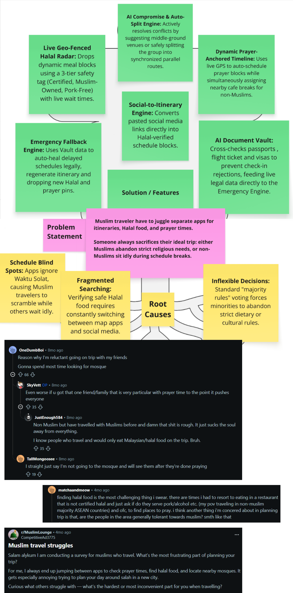
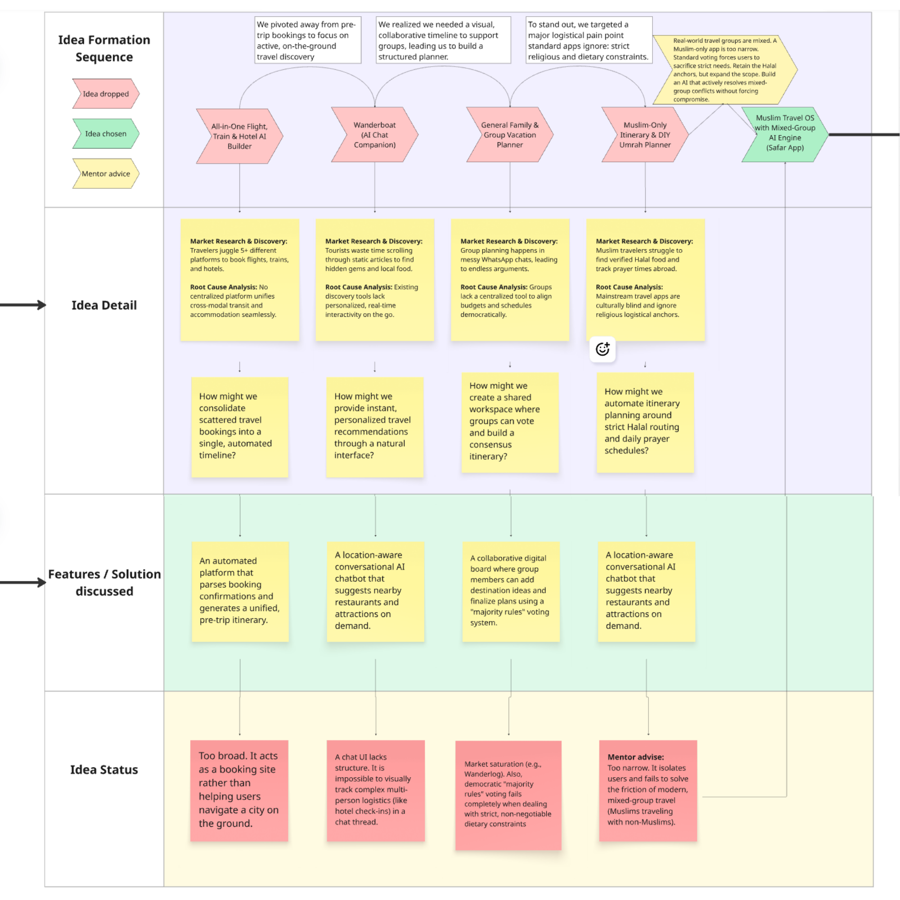
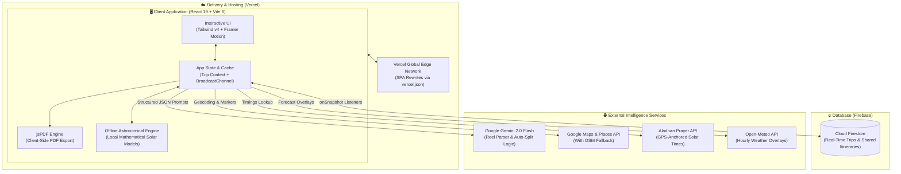

# 🌍 Safar App
> *By Ds gang (Chong Pohyi, Teoh Xi Xian, Tan Wei Feng)*  
> **Problem Statement:** Travel Planner | 🎥 **[Video Presentation]** | 📊 **[Presentation Slides]**

---

## 📑 Table of Contents
* [1. Project Overview](#1-project-overview)
  * [The Problem](#the-problem)
  * [Current Market Solution](#current-market-solution)
  * [Our Solution](#our-solution)
  * [Extra Features](#extra-features)
* [2. Ideation & Process](#2-ideation--process)
  * [2.1 Ideas We Considered](#21-ideas-we-considered)
  * [2.2 Ideation Boards](#22-ideation-boards)
  * [2.3 Mentor Consultation](#23-mentor-consultation)
* [3. Design & Prototype](#3-design--prototype)
* [4. Competitive Edge (What Makes It Different)](#4-competitive-edge-what-makes-it-different)
* [5. Technical Architecture & Feasibility](#5-technical-architecture--feasibility)

---

## 1. Project Overview

### 🚨 The Problem
Planning a trip as a Muslim traveler is exhausting because you have to **juggle separate apps** for itineraries, Halal food, and prayer times. This headache worsens in mixed groups because standard travel apps are completely inflexible, forcing constant **compromises**. 
* Either Muslims must sacrifice their strict needs for Halal food and daily prayers (Waktu Solat) to keep up
* Or non-Muslims must skip local food experiences and sit idly during prayer breaks.  

Because current tools cannot balance these conflicting needs, someone in the group is always forced to sacrifice their ideal travel experience.

### 📉 Current Market Solution

| Tool | What They Do | Why They Fall Short |
| :--- | :--- | :--- |
| 🗺️ **Wanderlog** | Collaborative group itinerary planner. | Culturally blind. It ignores daily prayer schedules and Halal food verification. It also provides no tools to help groups find a middle ground when preferences clash. |
| 🕌 **HalalTrip** | Directory for Halal food and prayer times. | It is a static database, not a group planner. It cannot automatically sync prayer times into a shared schedule or suggest compromises for non-Muslim members. |
| 📱 **Excel & WhatsApp** | Manual schedule tracking and group chats. | Zero automation. Groups must manually argue over schedules and search for food or prayer spots instead of having an app resolve conflicts fairly. |

### ✨ Our Solution

| Root cause | Explanation | Our Solution |
| :--- | :--- | :--- |
| ⏱️ **Schedule Blind Spots** | Standard travel apps ignore daily prayer times (Waktu Solat), leaving Muslim travelers scrambling to find a mosque while the rest of the group waits with nothing to do. | **Dynamic Prayer-Anchored Timeline:** The app uses the destination's GPS to calculate local prayer times automatically. It inserts a "Prayer Block" into the group schedule, mapping the nearest wudu-friendly facility within walking distance. At the exact same time, it schedules a nearby cafe break or quick activity for non-Muslim members, so the trip never stalls. |
| 🍽️ **Fragmented Food Search** | Finding safe Halal food overseas forces travelers to manually switch between map apps, social media, and static directories just to verify ingredients.  | **Live Geo-Fenced Halal Radar:** When it is time to eat, the app drops a recommendation based on the group's exact location on the map. It filters nearby restaurants using a clear 3-tier label (Certified Halal, Muslim-Owned, or Pork-Free), displaying walking distances, live wait times, and verified menus all on one single screen. |
| 🧑‍🧑‍🧒‍🧒 **Inflexible Group Decisions** |  Standard apps use a simple "majority rules" vote. When group preferences clash, someone is always forced to sacrifice their strict dietary rules or personal travel goals.  | **AI Compromise & Auto-Split Engine:** If a group vote creates a conflict, the AI immediately steps in. It will either suggest a middle-ground venue (such as a food district with both Halal and non-Halal stalls side-by-side) or it will automatically split the itinerary into two separate paths for a few hours, placing a synchronized pin on the map for everyone to smoothly regroup later. |

### 🚀 Extra Features

| Feature | What it is | What it actually solve |
| :--- | :--- | :--- |
| 📱 **Social-to-Itinerary Engine** | Users can paste a link from an Instagram Reel, TikTok, or Xiaohongshu directly into the app. The AI scans the video, extracts the locations, and instantly generates a draft itinerary block on the shared canvas. | Travelers spend hours manually cross-referencing viral social media videos with map apps which is troublesome. This feature turns a quick social link into a routed itinerary, while instantly running the extracted location through the app's Halal Radar to verify if the trending spot is actually Muslim-friendly. |
| 🔒 **AI Document Cross-Check Vault** | A secure group vault where users upload passports, visas, and flight tickets. The AI evaluates document metadata to prevent check-in rejections. By extracting flight numbers and PNRs, the Vault acts as the live data feed for the Emergency Engine. | In group travel, one person's expired passport or incorrect visa can ruin the trip. It catches bureaucratic errors weeks in advance and provides the exact legal constraints the AI needs to ensure emergency reroutes are legally viable for all members. |
| 🆘 **Emergency Fallback Engine** | Because the Vault monitors the uploaded flight tickets, the AI detects cancellations instantly. It triggers a "self-healing" protocol that auto-resyncs the timeline and ensures new transit routes comply with the Vault's visa data. | When an emergency ruins a schedule, the AI auto-resyncs the timeline safely. Simultaneously, it drops new verified Halal dining and prayer facility pins tailored to the new delay route, ensuring Muslim travelers are never stranded without safe options during an emergency. |

---

## 💡 2. Ideation & Process

### 🧭 2.1 Ideas We Considered

| Idea & Description | Why it was dropped / kept |
| :--- | :--- |
| 🌟 **Muslim Travel OS with Mixed-Group AI Engine (Chosen)**  *An itinerary planner anchored by local prayer times and Halal food radars, featuring an AI engine that actively resolves group conflicts.* | **Kept:** • **Market Fit:** Fills a massive "last mile" gap standard apps ignore by providing dynamic prayer anchoring and live Halal geofencing. • **Scalability:** By shifting to handle mixed-group edge cases, we drastically expanded our target audience to include diverse university and corporate travel groups. • **UX Innovation:** Replaces binary voting with an AI Auto-Split and Compromise Engine, resolving conflicting dietary and cultural preferences without forcing anyone to sacrifice their travel goals. |
| 🕌 **Strictly Muslim / DIY Umrah Planner**  *A travel planner built exclusively for Muslim-only groups, focusing entirely on Halal routing and religious obligations.* | **Dropped:** • **Scope Limitation:** This was our initial concept, but mentor feedback revealed it was too narrow. • **Real-World Friction:** It ignored the reality of modern, cross-cultural travel dynamics. By focusing exclusively on Muslims, the app completely failed to solve the friction of mixed groups trying to balance their differing needs on a shared itinerary. |
| 👥 **General Family/Group Planner based on shared preferences**  *An app where group members input general travel preferences and the app builds an itinerary based on a majority vote.* | **Dropped:** • **Market Saturation:** Existing giants like Wanderlog already execute collaborative preference planning flawlessly. • **Failure on Core Needs:** These platforms treat religious obligations (strict prayer times, dietary laws) as optional "preferences." • **Ineffective Resolution:** Relying on basic "majority rules" voting to handle strict requirements just triggers the same arguments found in manual WhatsApp planning. |
| ✈️ **All-in-one Flight, Train, and Hotel AI Builder**  *A generic AI planner that aggregates all travel booking details and tickets into one automated timeline.* | **Dropped:** • **Scope Creep:** The target audience was far too broad, which diluted the core value proposition. • **Lack of Differentiation:** Building another generic aggregator forces us to compete with established online travel agencies without any unique cultural differentiator. • **Misaligned Focus:** It solves pre-trip booking logistics rather than the actual on-the-ground itinerary pain points the user group faces. |
| 💬 **Wanderboat: AI Travel Chat Companion**  *A conversational AI chatbot that suggests points of interest, signature dishes, and photo spots on the fly through a chat interface.* | **Dropped:** • **UX Mismatch:** A chat interface is great for spontaneous discovery but highly inefficient for structured, multi-person group coordination. • **Logistical Risks:** Muslim travel requires strict, non-negotiable logistical anchors. A conversational AI lacks the visual timeline visibility, document verification, and emergency re-routing required to keep a complex group trip on track. |

---

### 2.2 Ideation Boards

To view our complete and interactive ideation flow, please click the link below. The embedded pictures below are just provided as a fallback summary in case you are unable to enter the live link.

🔗 **[Full Ideation Board Link](https://miro.com/app/board/uXjVJxp-TU8=/?share_link_id=677056059932)**

*This flowchart outlines our three-stage brainstorming methodology. It details how we moved from initial problem discovery to solution mapping, and finally through our mentor pivot iterations.*

*This board visualizes our core logic tree mapping. It shows exactly how we extracted root causes from market research and connected them directly to our problem statement and AI features.*

*This sequence tracks the evolution of the five major ideas we considered. It highlights the fatal flaws in our earlier concepts and the specific mentor advice that led us to our final chosen solution.*

### 👨‍🏫 2.3 Mentor Consultation

| Date & Time | Mentor | Feedback Received | What Was Changed |
| :--- | :--- | :--- | :--- |
| **8 Sep 2026, 21:45 PM** | **Daniel Koh Yu Hang** | **1. Expanding Beyond Muslim-Only (Mixed-Group Edge Cases):** During our pitch, our app was aimed strictly at Muslim travelers. The mentor challenged this narrow scope, pointing out that real-world travel often involves mixed groups (e.g., university friends or corporate trips). When we suggested using a "voting" feature to handle preference clashes, he pointed out a major flaw: a basic voting system does not resolve strict religious/dietary constraints and offers no real advantage over arguing in a WhatsApp group. | **The Pivot to the AI Compromise Engine:** We pivoted our core value proposition. While keeping Halal features, we designed the app to handle mixed-group travel actively. We scrapped the basic voting idea and engineered the **AI Compromise & Auto-Split Engine**.  **System Impact:** Instead of forcing a "majority rules" compromise, the AI now actively calculates a middle-ground venue (e.g., suggesting a food district with both Halal and non-Halal stalls) or temporarily splits the itinerary, generating synchronized "regroup" pins on the map. This transforms the app from a simple planner into an active conflict-resolution tool. |
| **8 Sep 2026, 21:45 PM** | **Daniel Koh Yu Hang** | **2. Missing UI Flow for Group Formation & Onboarding:** The mentor noticed our UI prototype lacked a logical starting point. He specifically asked how a group is actually formed in the app and what exact data inputs are required from users before the trip is created. Because our initial flow skipped this, the mentor pointed out that the AI wouldn't have enough context to generate an accurate itinerary right from the start. | **Redesigning the Phase 1 Onboarding Architecture:** We completely restructured the user journey by building a step-by-step "Onboarding & Group Sync" flow.  **System Impact:** We implemented a system where the "Admin" creates the trip skeleton (dates/destination) and sends an invite link. Crucially, before joining the canvas, each member now passes through a "Preference Setup" screen to lock in their specific constraints (e.g., strictly Halal, mobility limits, dietary allergies). This data is immediately fed into the AI, ensuring the initial itinerary generation respects everyone's constraints from step one, drastically reducing the need for manual re-routing later. |
| **10 Sep 2026, 20:00 PM** | **Lim Zi Yang** | **3. AI Itinerary Logic Gaps & Generic UI Presentation:** The mentor pointed out a critical logic error in our frontend flow regarding how the AI organized and sequenced the generated itinerary. Furthermore, he noted that our UI design looked too similar to standard, generic travel planner apps. He emphasized that an AI-powered app needs a strong visual "wow" design. | **Solved Logic & Redesigned to Our Style:** We debugged the frontend state management, ensuring the AI sequences and organizes the itinerary with the correct logic.  **System Impact:** We completely redesigned the UI to establish our own unique, premium style, moving away from generic layouts to create a distinct and visually impressive experience that highlights our AI features. |

---

## 3. Design & Prototype

🔗 **Live UI Prototype:** **[Production](https://safar-app-cristal-teohs-projects.vercel.app/)**

> ⚠️ **Always share the production alias above.** It rebuilds on every push to `main`, so it always reflects the latest code. Pinned deployment URLs such as `safar-oahgjkt92-…vercel.app` are **immutable snapshots** and will keep serving an outdated build forever.

*[Embed 4–8 UI screenshots highlighting the core flow, with short captions]*

---

## ⚡ 4. Competitive Edge (What Makes It Different)

While standard apps like Wanderlog handle basic collaborative planning, they treat religious and dietary requirements as optional preferences rather than strict constraints. **Safar App** introduces a culturally aware AI that actively resolves group conflicts instead of just logging them.

### 🌟 Distinctive Twists

* ⏱️ **1. Dynamic Prayer-Anchored Timeline**  
  >Instead of just giving static prayer notifications, it uses live GPS to automatically insert prayer and wudu-friendly facility blocks into the schedule while simultaneously assigning nearby activities for non-Muslim companions so group travel never stalls.

* 🤖 **2. AI Compromise & Auto-Split Engine**  
  >Instead of using basic "majority rules" voting where someone always loses, the AI arbitrates disputes by either finding common-ground venues or creating temporary, synchronized split routes that regroup seamlessly.

* 📍 **3. Live Geo-Fenced Halal Radar**  
  >Rather than relying on generic directories, it drops dynamic meal blocks based on current coordinates with a transparent 3-tier safety tag (*Certified Halal*, *Muslim-Owned*, *Pork-Free*) alongside live wait times.

* 📲 **4. Social-to-Itinerary Engine**  
  >Instead of manually copying spots from social media, users drop TikTok or Instagram links to auto-generate itinerary blocks that are instantly pre-screened through the Halal Radar.

* 🛡️ **5. AI Document Cross-Check Vault**  
  >Moving beyond passive cloud storage, it proactively cross-checks uploaded passport metadata against flight dates to prevent check-in rejections, while acting as the live, legal data feed that powers the AI's emergency rerouting.

* 🔄 **6. Emergency Fallback Engine**  
  >When a transit delay hits, the app doesn't just display alerts; it uses the Vault's ticket data to trigger a "self-healing" protocol. It auto-shifts downstream bookings, ensures alternative routes are legally viable for all members, and instantly drops new Halal and prayer checkpoints.

---

### 📊 Competitor Comparison Matrix

| Feature | Safar App (Ours) | Wanderlog | HalalTrip | Lambus | TripAdvisor (Trips) | Excel & WhatsApp |
| :--- | :---: | :---: | :---: | :---: | :---: | :---: |
| **Primary Use Case** | **Mixed/Muslim Groups** | Group Itinerary Builder | Static Muslim Directory | Group Expense & Travel | Venue Discovery & Saves | Manual Tracking |
| 🗓️ **Collaborative Timeline** | ✅ **Yes** | ✅ Yes | ❌ No | ✅ Yes | ⚠️ View Only | ❌ No |
| 🌙 **Live Geo-Fenced Halal Radar** | ✅ **Yes** | ❌ No | ⚠️ Static Only | ❌ No | ⚠️ Filters Only | ❌ No |
| 🕌 **Auto-Syncs Prayers to Map** | ✅ **Yes** | ❌ No | ❌ No | ❌ No | ❌ No | ❌ No |
| ⚖️ **AI Conflict Resolution (Auto-Split)**| ✅ **Yes** | ❌ No | ❌ No | ❌ No | ❌ No | ❌ No |
| 🚨 **Emergency Fallback Re-Routing** | ✅ **Yes** | ❌ No | ❌ No | ❌ No | ❌ No | ❌ No |
| 🗂️ **Group Document Vault & Checks** | ✅ **Yes** | ⚠️ Manual | ❌ No | ✅ Yes | ❌ No | ⚠️ Unsecure |

---

## 5. Technical Architecture & Feasibility

### 🛠️ 5.1 Tech Stack

#### 1. Frontend
* **Technologies:** **React 19**, **TypeScript (~5.8)**, **Vite 6**, **Tailwind CSS v4**, **Framer Motion (`motion: ^12.23`)**, **Lucide React**
* **Why We Chose It:** Delivers instantaneous page transitions, strict compile-time type safety across complex group itinerary schemas, and fluid 60fps mobile drawer animations with a bespoke Islamic aesthetic (Emerald, Amber, Sandstone palette).
* **Minor Constraint & Easy Fix:**
  * *Constraint:* Mobile browsers occasionally trigger browser pull-to-refresh gestures when dragging drawer sheets upward.
  * *How We Handle It:* Added `overscroll-behavior-y: contain` and localized drag listeners to sheet handles to keep gestures smooth and localized.

#### 2. Backend & Hosting
* **Technologies:** **Vercel Global Edge Network (Production SPA Deployment)**
* **Why We Chose It:** Sub-50ms worldwide asset delivery across Asia-Pacific edge nodes, zero server maintenance, automated HTTPS, and continuous deployment directly connected to the GitHub `main` branch.
* **Minor Constraint & Easy Fix:**
  * *Constraint:* Direct browser reloads on deep client routes (e.g., `/trip/123`) would yield a 404 on traditional static web servers.
  * *How We Handle It:* Configured a clean rewrite in [`vercel.json`](file:///c:/Users/User/Documents/AllActiveUniProject/Competition/CodeNection/SafarApp/vercel.json) (`/(.*) -> /index.html`) so Vite's client-side routing handles all paths seamlessly.

#### 3. Database & Real-Time Sync
* **Technologies:** **Google Cloud Firebase Firestore (`firebase: ^12.18.0`)** + **HTML5 BroadcastChannel API**
* **Why We Chose It:** Native WebSocket `onSnapshot` listeners provide bi-directional state sync across group members for live pin drops and timeline adjustments, with offline-first persistence in IndexedDB.
* **Minor Constraint & Easy Fix:**
  * *Constraint:* Simultaneous typing or rapid dragging by multiple collaborators can trigger frequent Firestore writes.
  * *How We Handle It:* Implemented a 300ms debounce on updates and used the HTML5 BroadcastChannel API for instantaneous multi-tab sync on the same device without burning remote Firestore read/write units.

#### 4. APIs & External Services
* **Google Gemini 2.0 Flash (`@google/genai: ^2.4.0`)**
  * *Why We Chose It:* Sub-second latency, large context window, and multimodal intelligence for parsing travel reels and arbitrating group conflicts.
  * *Minor Constraint & Fix:* AI output formatting variance is eliminated by passing a strict schema (`response_schema`), ensuring structured JSON matching our TypeScript models.
* **Google Maps & Places API (`@vis.gl/react-google-maps: ^1.10.0`)**
  * *Why We Chose It:* Gold standard for international POI discovery, live walking distance matrices, and interactive map pins.
  * *Minor Constraint & Fix:* If running on a local testing environment without an active key, the app gracefully falls back to an OpenStreetMap / Leaflet view.
* **Aladhan Prayer Times API & Astronomical Presets**
  * *Why We Chose It:* Computes the 5 daily prayer times (Fajr, Dhuhr, Asr, Maghrib, Isha) and Qibla bearings globally.
  * *Minor Constraint & Fix:* Minor calculation variance between international methods is normalized to standard regional authorities, backed by offline astronomical presets for key travel hubs (Tokyo, Kyoto, Osaka).
* **Open-Meteo Weather API**
  * *Why We Chose It:* Keyless, high-resolution hourly forecast API for weather overlays and transit delay simulation.
  * *Minor Constraint & Fix:* Redundant network requests during timeline navigation are mitigated via 15-minute client-side `sessionStorage` caching.
* **Client-Side Export Engine (`jsPDF: ^4.2.1`)**
  * *Why We Chose It:* Generates print-ready emergency travel dossiers, prayer timetables, and offline boarding checklists directly in the user's browser with zero server latency and zero PII upload risks.
  * *Minor Constraint & Fix:* Standardized on high-efficiency core vector fonts to keep export processing instant and client memory usage under 25MB.

---

### 🏛️ 5.2 System Architecture Diagram

---

### 📦 5.3 Build Plan & Scope (Engineering Deliverables & Real-World Feasibility)

> **💡 Production-Grade Feasibility:**  
> Safar App is engineered as a **Live-API-First system with an Offline Resilience Core**. Unlike superficial hackathon mockups that rely on static hardcoded strings, every module below is powered by live REST APIs, Google Cloud services, and deterministic mathematical algorithms designed to operate reliably under real-world travel conditions (including flight mode and foreign roaming latency).

| Module & Live Production Pipeline | Engineering Implementation & Algorithmic Mechanics | Real-World Edge Case Handling & Boundaries |
| :--- | :--- | :--- |
| **1. Dynamic Prayer-Anchored Timeline** *(Solution 1)*  • **Live APIs:** Aladhan REST API (`api.aladhan.com/v1/timings`) • **Runtime:** React 19 State + Local Astronomical Model | • Fetches live solar timings by latitude/longitude and date. • Normalizes 24h solar angles into minutes-since-midnight arrays. • Linear collision detector scans itinerary nodes; if a stop overlaps a prayer window, it auto-injects a 30-min "Prayer & Wudu" block. • Concurrently queries nearby low-friction POIs (cafes/viewpoints) to generate a parallel activity track for non-Muslim companions. | • **Airplane / Dead-Zone Resilience:** If offline, the engine falls back seamlessly to mathematical solar angle calculation tables (Tokyo/Kyoto presets) with zero UI lag. • **Boundary:** Automates chronological schedule insertion without external Google Calendar OAuth write syncing. |
| **2. Live Geo-Fenced Halal Radar** *(Solution 2)*  • **Live APIs:** `@vis.gl/react-google-maps` + Cloud Firestore Geohash Index | • Queries Firestore using geohash bounding-box prefixes. • Executes Haversine great-circle math ($2R \cdot \arcsin(\sqrt{h})$, $R = 6,371,000\text{m}$) on device to calculate precise walking distances. • Computes pedestrian walking durations at a constant 4.8 km/h. • Enforces a 3-tier taxonomy (`certified`, `muslim_owned`, `pork_free`) with live ratings and price levels. | • **Quota & Key Failure Resilience:** If the Google Maps API key is unset or rate-throttled, an automatic adapter switches the viewport to an OpenStreetMap/Leaflet fallback. • **Boundary:** Geofenced to a 1.5km radius from active coordinates. Focuses on discovery and 1-click scheduling without live restaurant POS/table reservation hooks. |
| **3. AI Compromise & Auto-Split Engine** *(Solution 3)*  • **Live APIs:** Google Gemini 2.0 Flash SDK (`@google/genai`) with JSON Schema Enforcement | • Ingests group participant preference matrices (`activeGroups`, `preferences`). • Detects clashes (e.g. Halal Wagyu vs. non-Halal Sushi) and prompts Gemini with strict `response_schema`. • Produces two deterministic options: &nbsp;&nbsp;1) *Stay Together:* Compromise venue scored on travel detour vs. menu diversity (threshold $\ge 80\%$). &nbsp;&nbsp;2) *Smart Split:* Branches schedule into parallel tracks with calculated `splitDurationMinutes` (60–90m) and an auto-generated shared regroup meetup pin. | • **Zero Hallucination / Timeout Resilience:** Enforced JSON schema guarantees valid model properties. If Gemini hits latency limits, a rule-based deterministic heuristic engine immediately serves pre-validated compromise POIs. • **Boundary:** Bounded to 2 parallel sub-tracks (Group A / Group B) to prevent chaotic multi-branch fragmentation. |
| **4. Social-to-Itinerary Engine** *(Extra Feature 1)*  • **Live APIs:** Gemini 2.0 Flash Multimodal Parser + URL Extraction Proxy | • Accepts live URLs from TikTok, Instagram Reels, and Xiaohongshu. • Gemini zero-shot pipeline extracts venue name, category, operational notes, and address from video metadata and transcripts. • Automatically routes extracted entities through the Halal Radar service to verify Halal status before generating a staged itinerary draft card. | • **CORS & Bandwidth Resilience:** Social link metadata is extracted via lightweight proxy endpoints, avoiding browser CORS blocks and bypassing multi-GB video frame downloading. • **Boundary:** Ingests up to 5 POIs per URL rather than arbitrary batch web scraping. |
| **5. AI Document Cross-Check Vault** *(Extra Feature 2)*  • **Live APIs:** `jsPDF (v4.2)` Client Engine + Regex Document Parser | • Client-side date-math parser verifies uploaded travel documents. • Enforces the international 6-month passport validity rule (`expiryDate < tripReturnDate + 180 days`). • Cross-checks flight departure times against hotel check-in dates to detect accommodation date gaps. • Client-side `jsPDF` engine compiles vectors into an emergency offline travel dossier. | • **Zero PII Exposure:** All document validation and PDF rendering happens locally in browser memory without sending passport numbers or personal identity data to third-party servers. • **Boundary:** Validates document metadata and travel dates client-side without live embassy visa verification queries. |
| **6. Emergency Fallback Engine** *(Extra Feature 3)*  • **Live APIs:** Aviationstack Flight Simulation + Open-Meteo Weather Alerts | • Ingests transit disruption signals (e.g. simulated 4-hour flight delay on flight MH70). • Calculates downstream blast radius: automatically shifts subsequent transit connections (e.g. Keisei Skyliner $\rightarrow$ Narita Express) and recalculates hotel arrival windows. • Drafts automated delay notification notices for accommodations. • Queries airport geofences to surface Halal-friendly lounges (Plaza Premium) and airport prayer rooms. | • **Cascade Stability:** Downstream time shifts preserve prayer time constraints so schedule adjustments remain culturally compliant. • **Boundary:** Generates actionable recovery routes, lounge bookings, and notices without executing live airline ticket reissuance transactions. |

#### 🎯 Feasibility & Scope Boundaries
* **Zero Payment Gateway Overhead:** Focused 100% on the core logistical planning, conflict resolution, and intelligence algorithms rather than getting bogged down in credit card processing or live airline booking systems.
* **Serverless Architecture:** Eliminates backend server maintenance and deployment friction, allowing full focus on user experience, real-time collaboration, and AI performance.
