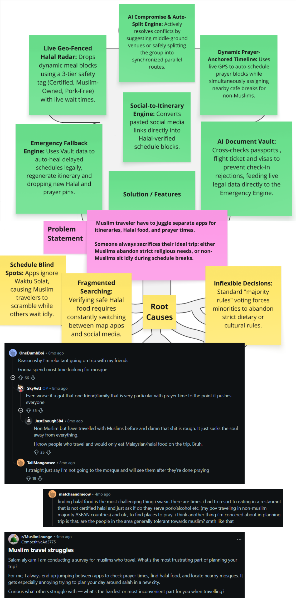
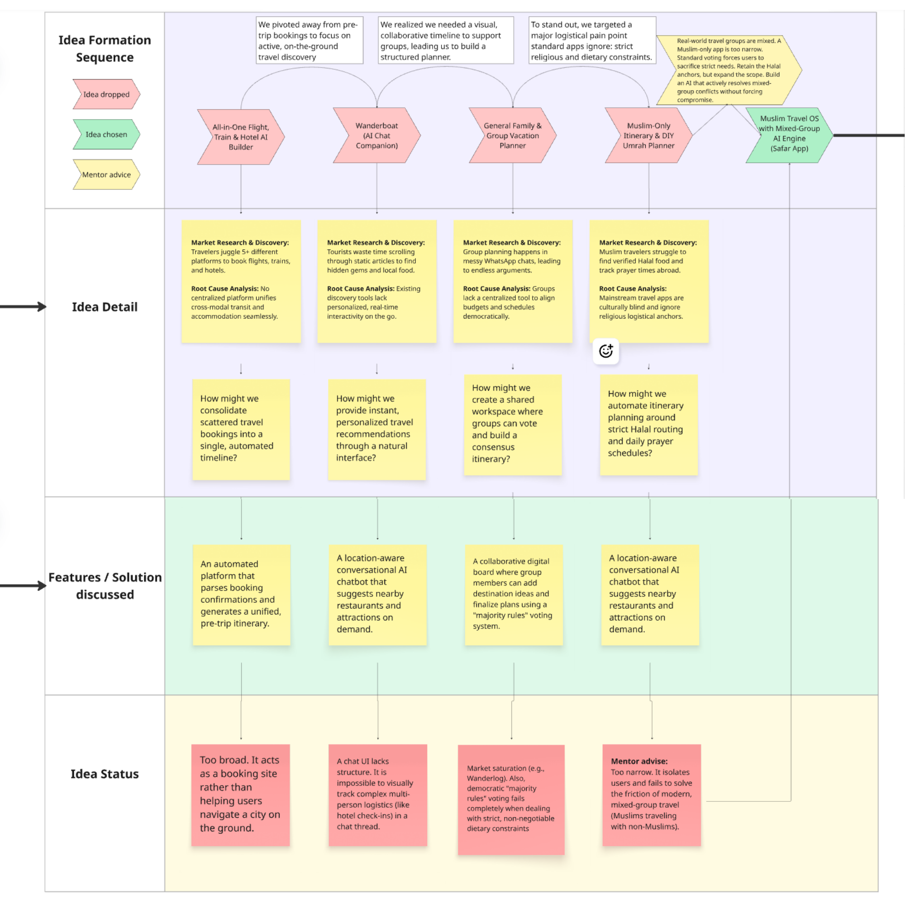

# 🌍 Safar App
> *By Ds gang (Chong Pohyi, Teoh Xi Xian, Tan Wei Feng)*  
> **Problem Statement:** Travel Planner | 🎥 **[Video Presentation](https://youtu.be/gcn_F3Ni2fs)** | 📊 **[Presentation Slides](https://safar-app-cristal-teohs-projects.vercel.app/pitch)
**

> **Documentation status:** Section 2 preserves the original ideation and mentor history. Sections 3–6 describe the current app. See the [desktop/tablet guide](User%20Guide/Desktop%20Guide.md), [phone guide](User%20Guide/Phone/Phone%20Guide.md), and [README change summary](README-update-recommendations.md).
---

## 📑 Table of Contents

1. [Project Overview](#1-project-overview)
2. [Ideation & Process](#2-ideation--process)
3. [Current App & User Flow](#3-current-app--user-flow)
4. [What Safar Does Today](#4-what-safar-does-today)
5. [Technical Architecture](#5-technical-architecture)
6. [Try It & Run It](#6-try-it--run-it)

---

<a id="1-project-overview"></a>
## 1. Project Overview

<a id="the-problem"></a>
### 🚨 The Problem
Planning a trip as a Muslim traveler is exhausting because you have to **juggle separate apps** for itineraries, Halal food, and prayer times. This headache worsens in mixed groups because standard travel apps are completely inflexible, forcing constant **compromises**. 
* Either Muslims must sacrifice their strict needs for Halal food and daily prayers (Waktu Solat) to keep up
* Or non-Muslims must skip local food experiences and sit idly during prayer breaks.  

<p align="left">Because current tools cannot balance these conflicting needs, someone in the group is always forced to sacrifice their ideal travel experience.</p>

<a id="current-market-solution"></a>
### 📉 Original Market Comparison

This table records the team's initial problem framing during ideation; it is not a current feature audit of the other products.

| Tool | What They Do | Why They Fall Short |
| :--- | :--- | :--- |
| 🗺️ **Wanderlog** | Collaborative group itinerary planner. | Culturally blind. It ignores daily prayer schedules and Halal food verification. It also provides no tools to help groups find a middle ground when preferences clash. |
| 🕌 **HalalTrip** | Directory for Halal food and prayer times. | It is a static database, not a group planner. It cannot automatically sync prayer times into a shared schedule or suggest compromises for non-Muslim members. |
| 📱 **Excel & WhatsApp** | Manual schedule tracking and group chats. | Zero automation. Groups must manually argue over schedules and search for food or prayer spots instead of having an app resolve conflicts fairly. |

<a id="our-solution"></a>
### ✨ Current Solution

Safar gives a mixed group one shared trip workspace. Members set their food, prayer, pace and budget needs; add fixed bookings and places; vote on ideas; and build a daily plan around approved stops and prayer times. The [screenshot user guide](User%20Guide/Desktop%20Guide.md) follows this flow in the live demo.

| Need | Current app behavior |
| :--- | :--- |
| Prayer-aware scheduling | Prayer times are calculated from the place, date and regional method. The plan displays fixed prayer windows and can include nearby facilities and parallel free time for non-praying members. |
| Halal food discovery | Food search combines place sources and shows the evidence behind each label. A label may be certified, listed halal, likely, pork-free or unchecked. Travellers should confirm dietary requirements with the restaurant. |
| Group decisions | Members vote Agree or Disagree on Ideas. When needs conflict, Safar can present middle grounds or a split plan for the admin to review and accept. |

<a id="extra-features"></a>
### 🚀 Additional Features

* **Social links to Ideas:** Paste a supported social link, review the places Safar extracts, then add the useful candidates to the group board. Results depend on the link and available services.
* **Private Document Vault:** Upload a travel document, review server-extracted fields, and choose whether to retain the original file. The app can check dates and export a PDF dossier; travellers remain responsible for confirming official passport and visa requirements.
* **Disruption support:** When flight-status monitoring is configured, a scheduled check can raise a delay or cancellation report near departure. An admin previews and applies a proposed schedule resync. Weather alerts can flag outdoor stops at risk.

---

<a id="2-ideation--process"></a>
## 💡 2. Ideation & Process

<a id="21-ideas-we-considered"></a>
### 🧭 2.1 Ideas We Considered

| Idea & Description | Why it was dropped / kept |
| :--- | :--- |
| 🌟 **Muslim Travel OS with Mixed-Group AI Engine (Chosen)**<br><br>*An itinerary planner anchored by local prayer times and Halal food radars, featuring an AI engine that actively resolves group conflicts.* | **Kept:**<br>• **Market Fit:** Fills a massive "last mile" gap standard apps ignore by providing dynamic prayer anchoring and live Halal geofencing.<br>• **Scalability:** By shifting to handle mixed-group edge cases, we drastically expanded our target audience to include diverse university and corporate travel groups.<br>• **UX Innovation:** Replaces binary voting with an AI Auto-Split and Compromise Engine, resolving conflicting dietary and cultural preferences without forcing anyone to sacrifice their travel goals. |
| 🕌 **Strictly Muslim / DIY Umrah Planner**<br><br>*A travel planner built exclusively for Muslim-only groups, focusing entirely on Halal routing and religious obligations.* | **Dropped:**<br>• **Scope Limitation:** This was our initial concept, but mentor feedback revealed it was too narrow.<br>• **Real-World Friction:** It ignored the reality of modern, cross-cultural travel dynamics. By focusing exclusively on Muslims, the app completely failed to solve the friction of mixed groups trying to balance their differing needs on a shared itinerary. |
| 👥 **General Family/Group Planner based on shared preferences**<br><br>*An app where group members input general travel preferences and the app builds an itinerary based on a majority vote.* | **Dropped:**<br>• **Market Saturation:** Existing giants like Wanderlog already execute collaborative preference planning flawlessly.<br>• **Failure on Core Needs:** These platforms treat religious obligations (strict prayer times, dietary laws) as optional "preferences."<br>• **Ineffective Resolution:** Relying on basic "majority rules" voting to handle strict requirements just triggers the same arguments found in manual WhatsApp planning. |
| ✈️ **All-in-one Flight, Train, and Hotel AI Builder**<br><br>*A generic AI planner that aggregates all travel booking details and tickets into one automated timeline.* | **Dropped:**<br>• **Scope Creep:** The target audience was far too broad, which diluted the core value proposition.<br>• **Lack of Differentiation:** Building another generic aggregator forces us to compete with established online travel agencies without any unique cultural differentiator.<br>• **Misaligned Focus:** It solves pre-trip booking logistics rather than the actual on-the-ground itinerary pain points the user group faces. |
| 💬 **Wanderboat: AI Travel Chat Companion**<br><br>*A conversational AI chatbot that suggests points of interest, signature dishes, and photo spots on the fly through a chat interface.* | **Dropped:**<br>• **UX Mismatch:** A chat interface is great for spontaneous discovery but highly inefficient for structured, multi-person group coordination.<br>• **Logistical Risks:** Muslim travel requires strict, non-negotiable logistical anchors. A conversational AI lacks the visual timeline visibility, document verification, and emergency re-routing required to keep a complex group trip on track. |

---

<a id="22-ideation-boards"></a>
### 2.2 Ideation Boards

To view our complete and interactive ideation flow, please click the link below. The embedded pictures below are just provided as a fallback summary in case you are unable to enter the live link.

🔗 **[Full Ideation Board Link](https://miro.com/app/board/uXjVJxp-TU8=/?share_link_id=677056059932)**


*This flowchart outlines our three-stage brainstorming methodology. It details how we moved from initial problem discovery to solution mapping, and finally through our mentor pivot iterations.*


*This board visualizes our core logic tree mapping. It shows exactly how we extracted root causes from market research and connected them directly to our problem statement and AI features.*


*This sequence tracks the evolution of the five major ideas we considered. It highlights the fatal flaws in our earlier concepts and the specific mentor advice that led us to our final chosen solution.*

<a id="23-mentor-consultation"></a>
### 👨‍🏫 2.3 Mentor Consultation

| Date & Time | Mentor | Feedback Received | What Was Changed |
| :--- | :--- | :--- | :--- |
| **8 Sep 2026, 21:45 PM** | **Daniel Koh Yu Hang** | **1. Expanding Beyond Muslim-Only (Mixed-Group Edge Cases):**<br>During our pitch, our app was aimed strictly at Muslim travelers. The mentor challenged this narrow scope, pointing out that real-world travel often involves mixed groups (e.g., university friends or corporate trips). When we suggested using a "voting" feature to handle preference clashes, he pointed out a major flaw: a basic voting system does not resolve strict religious/dietary constraints and offers no real advantage over arguing in a WhatsApp group. | **The Pivot to the AI Compromise Engine:**<br>We pivoted our core value proposition. While keeping Halal features, we designed the app to handle mixed-group travel actively. We scrapped the basic voting idea and engineered the **AI Compromise & Auto-Split Engine**.<br><br>**System Impact:** Instead of forcing a "majority rules" compromise, the AI now actively calculates a middle-ground venue (e.g., suggesting a food district with both Halal and non-Halal stalls) or temporarily splits the itinerary, generating synchronized "regroup" pins on the map. This transforms the app from a simple planner into an active conflict-resolution tool. |
| **8 Sep 2026, 21:45 PM** | **Daniel Koh Yu Hang** | **2. Missing UI Flow for Group Formation & Onboarding:**<br>The mentor noticed our UI prototype lacked a logical starting point. He specifically asked how a group is actually formed in the app and what exact data inputs are required from users before the trip is created. Because our initial flow skipped this, the mentor pointed out that the AI wouldn't have enough context to generate an accurate itinerary right from the start. | **Redesigning the Phase 1 Onboarding Architecture:**<br>We completely restructured the user journey by building a step-by-step "Onboarding & Group Sync" flow.<br><br>**System Impact:** We implemented a system where the "Admin" creates the trip skeleton (dates/destination) and sends an invite link. Crucially, before joining the canvas, each member now passes through a "Preference Setup" screen to lock in their specific constraints (e.g., strictly Halal, mobility limits, dietary allergies). This data is immediately fed into the AI, ensuring the initial itinerary generation respects everyone's constraints from step one, drastically reducing the need for manual re-routing later. |
| **10 Sep 2026, 20:00 PM** | **Lim Zi Yang** | **3. AI Itinerary Logic Gaps & Generic UI Presentation:**<br>The mentor pointed out a critical logic error in our frontend flow regarding how the AI organized and sequenced the generated itinerary. Furthermore, he noted that our UI design looked too similar to standard, generic travel planner apps. He emphasized that an AI-powered app needs a strong visual "wow" design. | **Solved Logic & Redesigned to Our Style:**<br>We debugged the frontend state management, ensuring the AI sequences and organizes the itinerary with the correct logic.<br><br>**System Impact:** We completely redesigned the UI to establish our own unique, premium style, moving away from generic layouts to create a distinct and visually impressive experience that highlights our AI features. We have integrated real live map api ,real weather anime api and effects on our UI design to simulate what a real travel planner website should have.|

---

<a id="3-current-app--user-flow"></a>
## 📱 3. Current App & User Flow

The [live app](https://safar-app-cristal-teohs-projects.vercel.app/) has a 13-step guest demo. It creates a temporary copy of a sample Japan trip and shows the same screens used for a real trip. See the [desktop/tablet guide](User%20Guide/Desktop%20Guide.md) and [phone guide](User%20Guide/Phone/Phone%20Guide.md) for screen-by-screen captures.

1. **Create or open a trip.** A signed-in planner chooses destinations and dates; teammates join through an invite link. The guest demo starts with four sample members.
2. **Review group needs.** People records dietary rules, prayer needs, pace, interests and budget before places are suggested.
3. **Add fixed bookings.** Flights, trains and hotels become time anchors. Uploaded ticket details are reviewed before saving.
4. **Discover and suggest places.** Food search shows halal evidence and recent traveller queue reports where available. Places from search, social links or manual entry go to Ideas.
5. **Vote and resolve conflicts.** Members vote on Ideas. A disagreement can lead to a reviewed middle ground or temporary split with a regroup plan.
6. **Build and inspect the plan.** The planner previews and applies Auto-plan, then checks travel time, meals, prayer windows and nearby facilities in the daily timeline.

The images in [images/](images/) show the original concept and prototype. They should be treated as historical illustrations; the user guides contain current app screenshots.

---

<a id="4-what-safar-does-today"></a>
## ⚡ 4. What Safar Does Today

| Area | Implemented behavior | Boundary |
| :--- | :--- | :--- |
| Shared planning | Firestore-backed trip, members, ideas, bookings and schedule with live client listeners. | An internet connection and configured Firebase project are needed for shared updates. |
| Prayer | Local calculations through the adhan library, with country-aware methods and a prayer-aware timeline. | Travellers should verify local prayer times against their preferred authority. |
| Halal Radar | Google and open-map place sources, evidence-based labels, traveller reports and optional recent queue reports. | Listings and AI assessments are guidance, not a universal certification or live restaurant feed. |
| Group decisions | Agree/Disagree votes, conflict warnings, middle-ground options and an admin-reviewed split. | A split is applied only after a group decision; the app does not override member preferences automatically. |
| Social import | Extracts candidate places from supported links for review. | Provider access and available link content affect extraction. |
| Vault | Private Firebase Storage upload, server-side AI extraction, user confirmation and PDF export. | Files leave the device when uploaded. The app does not make legal visa determinations. |
| Disruption response | Optional flight checks and weather alerts can raise reports; an admin can preview and apply a resync. | The app does not reissue airline tickets or send accommodation notices automatically. |

---

<a id="5-technical-architecture"></a>
## 🛠️ 5. Technical Architecture

* **Frontend:** React 19, TypeScript, Vite 6, Tailwind CSS 4, React Router and Lucide React. The PWA service worker caches the app shell.
* **Backend and hosting:** Vercel serves the SPA and one serverless router at [api/router.ts](api/router.ts). [vercel.json](vercel.json) routes API calls to the function and app paths to the SPA.
* **Identity and data:** Firebase Authentication, Firestore and Firebase Storage. Firestore listeners update shared trip views.
* **Prayer and planning:** The adhan package calculates times locally; domain rules schedule fixed bookings, stops, meals and prayer windows.
* **Places and routes:** Google services are used when configured; Photon, OpenStreetMap-based services and remembered places provide fallbacks. Some functions require provider keys or quotas.
* **AI:** Server-side extraction uses configured Gemini models, with a Groq fallback where available. Outputs still require review, especially for documents and dietary claims.
* **Weather and flights:** Open-Meteo supports forecasts and alerts. Optional Aviationstack checks monitor booked flights near departure and raise reports for admin review.
* **Exports:** jsPDF generates the travel dossier in the browser after relevant data is loaded.

The exact availability of external services depends on deployment credentials, quotas and provider responses. See [.env.example](.env.example) for configuration names and [package.json](package.json) for the installed stack.

---

<a id="6-try-it--run-it"></a>
## 🚀 6. Try It & Run It

* **Live app:** https://safar-app-cristal-teohs-projects.vercel.app
* **Demo trip (no account):** https://safar-app-cristal-teohs-projects.vercel.app/demo — you play Aisyah, planning a December week in Japan for four very different people, guided step by step. Sample documents are in [`public/demo-kit/`](public/demo-kit).
* **Pitch deck:** https://safar-app-cristal-teohs-projects.vercel.app/pitch
* **User guides:** [Desktop/tablet](User%20Guide/Desktop%20Guide.md) · [Phone](User%20Guide/Phone/Phone%20Guide.md)
* **README review:** [What changed and why](README-update-recommendations.md)

### Project structure

| Folder | What's in it |
| :--- | :--- |
| `src/domain/` | The rules, shared by the app and the server: prayer times, timeline and placement, voting and splits, halal conflicts, stays, expenses, vault checks, qibla, the demo story (with unit tests next to each file) |
| `src/pages/`, `src/trip/` | The screens: landing, sign-in, demo, my trips; and inside a trip — Home, Plan, Ideas, Food, Bookings, Money, People, Settings, the demo's Trip Quest |
| `src/ui/`, `src/components/live/`, `src/lib/` | Shared UI pieces, header and inbox, live Firestore listeners, the API client |
| `api/` | One Vercel function (`api/router.ts`) serving every `/api/*` route in `api/_routes/`, with helpers in `api/_lib/` (AI reading, places, routes, prayer places, push, the demo trip) |
| `scripts/` | End-to-end tests (`e2e-*.mjs`), key checks, rule deployment, the demo kit and preview image sources |
| `public/` | Icons, the demo kit files, the link-preview image, the push service worker |
| `firestore.rules`, `storage.rules` | Who can read what (released with `npm run deploy:rules`) |

### Run it locally

The guest demo and write operations need valid Firebase client and Admin credentials in `.env.local`. Copying the example alone is not enough. A malformed Admin private key causes the demo start request to fail with HTTP 500.

```bash
npm install
cp .env.example .env.local   # fill in the keys (see the comments in the file)
npm run dev                  # app + API on http://localhost:5173
npm test                     # unit tests
npm run build                # production build
npm run typecheck            # TypeScript check
npm run e2e:demo             # API demo test (needs npm run dev and working Firebase Admin credentials)
```

