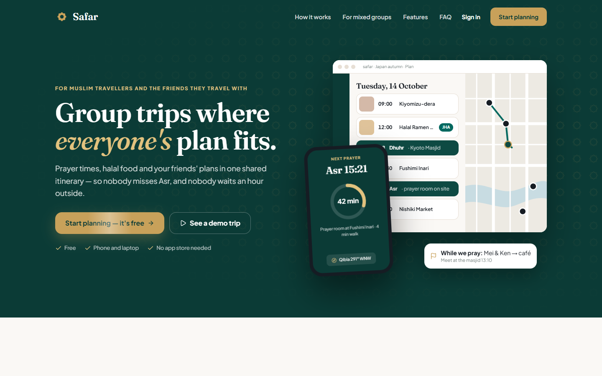
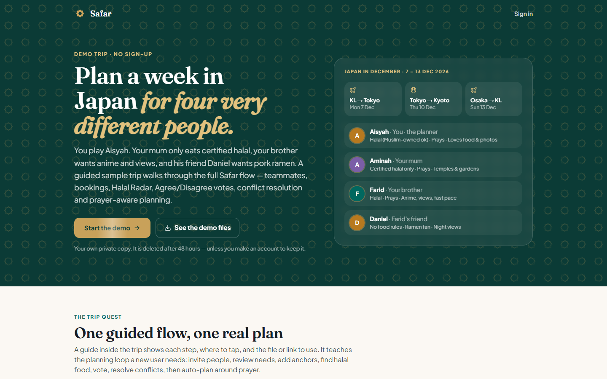
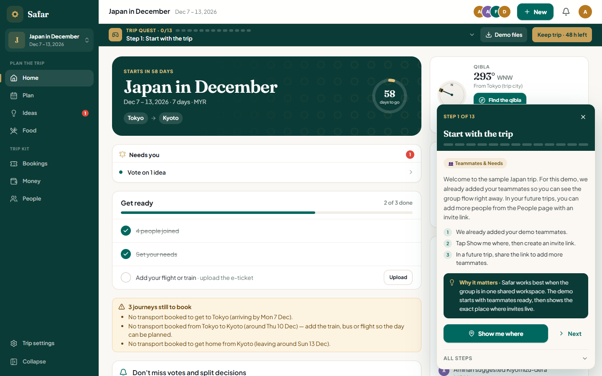

# Safar user guide

For the phone layout, use the [phone user guide](Phone/Phone%20Guide.md).

These screenshots were captured in a fresh Chrome session from the [live Safar app](https://safar-app-cristal-teohs-projects.vercel.app/) on 10 October 2026. The session's Safar site data and browser cache were cleared, then the page was refreshed before capture. The 13 steps follow the app's built-in Trip Quest. Each step has an instruction screenshot and, where the app offers **Show me where**, a screenshot of the destination screen.

The screenshots show the live demo in Chrome. The Food search completed, and the Ichiran vote was submitted so the 2–2 split and decision options are visible. Booking uploads and Auto-plan application were not submitted during capture. Your own trip data and live search results may differ.

## Start

1. Open Safar and choose **See a demo trip**. 
2. On the demo introduction, choose **Start the demo**. Safar creates a temporary guest trip. 
3. The trip overview opens with the Trip Quest guide. 

## Trip Quest

| Step | What to do | Guide prompt | Destination screen |
| --- | --- | --- | --- |
| 1. Start with the trip | Open **People**, then create an invite link. | [Prompt](01-start-with-the-trip-instructions.png) | [People and invite links](01-start-with-the-trip-screen.png) |
| 2. Meet the group | Open **People** and select **View group preferences**. | [Prompt](02-meet-the-group-instructions.png) | [Group members](02-meet-the-group-screen.png) |
| 3. Add a teammate | In **People → Invite links**, create and copy an invite link to share with a teammate. The pictured demo link was revoked after capture. | [Prompt](03-add-a-teammate-instructions.png) | [Invite links](03-add-a-teammate-screen.png) |
| 4. Review preferences | Review group rules, then choose **Edit my preferences**. | [Prompt](04-review-preferences-instructions.png) | [Group preferences](04-review-preferences-screen.png) |
| 5. Add fixed bookings | Use the sample flight, train and hotel documents in **Demo files** with **Bookings → Add ticket or hotel**. Review the extracted details before saving. | [Prompt](05-add-fixed-bookings-instructions.png) | [Bookings](05-add-fixed-bookings-screen.png) |
| 6. Find food with Halal Radar | Open **Food** near Kyoto Station, compare evidence and status, then add a suitable place to Ideas. Confirm halal details with the restaurant. | [Prompt](06-find-food-with-halal-radar-instructions.png) | [Food search](06-find-food-with-halal-radar-screen.png) |
| 7. Suggest a place or link | In **Ideas**, use **Add place or link** and paste the sample Instagram link provided in Trip Quest. | [Prompt](07-suggest-a-place-or-link-instructions.png) | [Ideas](07-suggest-a-place-or-link-screen.png) |
| 8. Vote Agree or Disagree | In **Ideas → Vote now**, scroll through an idea to its **Agree** and **Disagree** buttons. Add a reason when needed. | [Prompt](08-vote-agree-or-disagree-instructions.png) | [Voting ideas](08-vote-agree-or-disagree-screen.png) |
| 9. Trigger a food conflict | Open Ichiran in **Vote now**, choose **Agree**, then confirm **I'll only have drinks / eat elsewhere**. The vote becomes **2 Agree / 2 Disagree**. | [Prompt](09-trigger-a-food-conflict-instructions.png) | [Ichiran vote](09-trigger-a-food-conflict-screen.png) |
| 10. Solve the conflict | In **Ideas → Needs a decision**, review the middle ground options and regroup plan. The team lead can accept, reserve or reject the conflicted idea for the itinerary. | [Prompt](10-solve-the-conflict-instructions.png) | [Decision board](10-solve-the-conflict-screen.png) |
| 11. Auto-plan the trip | In **Plan**, choose **Auto-plan → Whole trip** for an AI schedule. Review the preview before applying it, or edit the timeline manually. | [Prompt](11-auto-plan-the-trip-instructions.png) | [Plan](11-auto-plan-the-trip-screen.png) |
| 12. Check prayer time | In **Plan**, inspect a prayer time, nearby facility, and the parallel activity for a teammate who does not pray. | [Prompt](12-check-prayer-time-instructions.png) | [Prayer-aware plan](12-check-prayer-time-screen.png) |
| 13. Final review | Review **Plan, Ideas, Food, and People**. Revisit completed steps using the guide's **Show** buttons. | [Prompt](13-final-review-instructions.png) | — |

For a real trip, use **Start planning** on the landing page, sign in, and create a trip. The temporary demo is removed after 48 hours unless you choose **Keep trip** and create an account.
